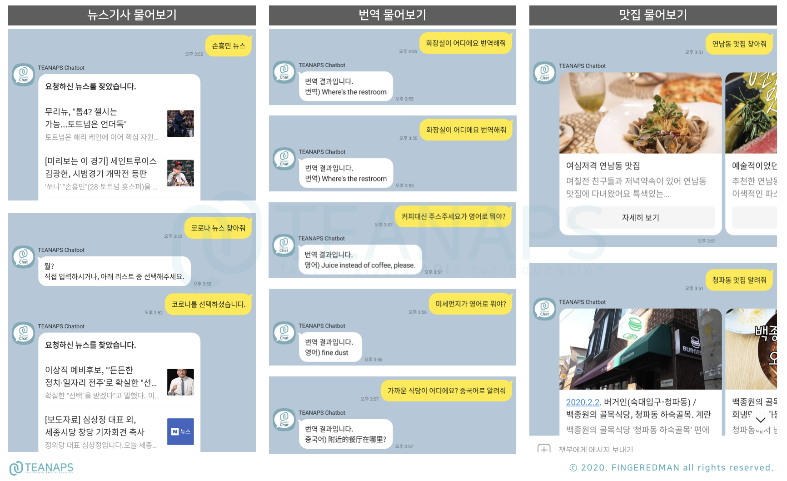
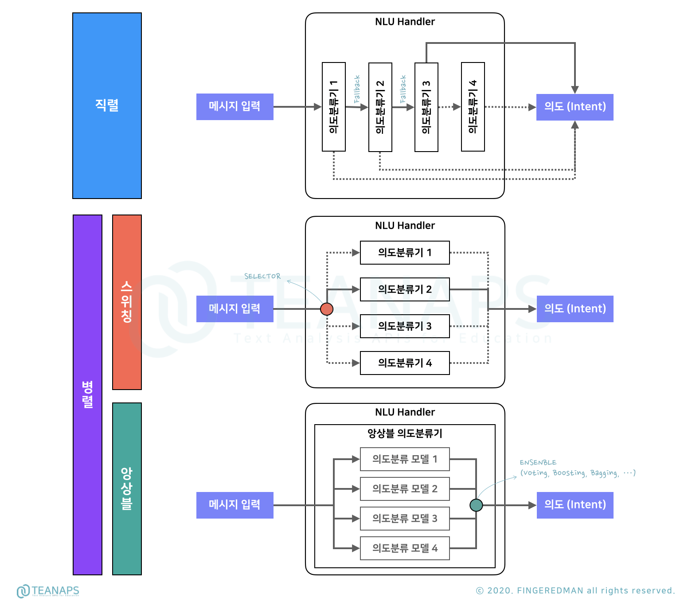
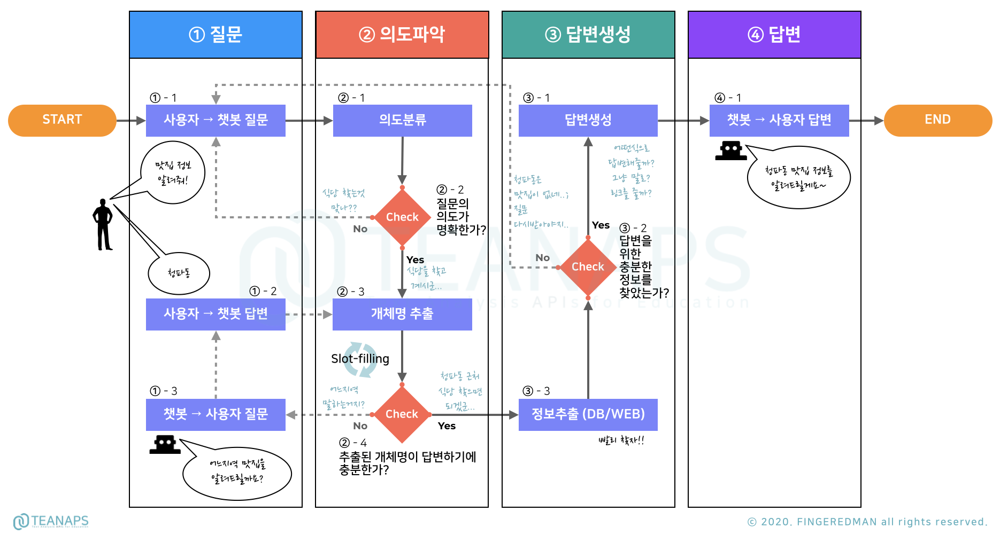

# `TEANAPS`를 활용해 하루만에 챗봇 구현하기

> 본 자료는 챗봇의 기본적인 구조를 설명하고 구현방법을 설명하기 위해 제작되었습니다. 챗봇은 `AI`기술과 `자연어처리` 기술을 활용해 사람처럼 대화가 가능한 인터페이스를 제공합니다. 챗봇은 그 사용법이 사람과 대화하는 방식과 유사하여 사용법이 친근하고, 온라인 환경을 선호하는 현대인들이 접근하기 매우 편리한 수단입니다. 때문에 챗봇이 적용되는 영역은 단순한 질의응답 부터 상품주문, 고객상담, 정보검색 까지 다양하게 확장되고 있으며, 다양한 서비스가 챗봇을 도입하여 활용하고 있습니다.  
`TEANAPS Chat-bot`은 `TEANAPS` 패키지에서 제공하는 다양한 자연어처리 기술을 활용하여 빠르게 직접 챗봇의 기본기능을 수행하도록 구현되었습니다. 또한 `Google Dialogflow`, `Kakao i Open Builder`와 함께 동작하여 기능확장과 인터페이스 연동이 용이합니다. 챗봇에 대한 이해를 위해 `TEANAPS` 자료의 [`User Guide`](https://github.com/fingeredman/teanaps/blob/master/document/teanaps_user_guide-install_teanaps.md#teanaps-user-guide)와 [`Tutorial`](https://github.com/fingeredman/teanaps/blob/master/document/teanaps_user_guide-tutorial.md#teanaps-user-guide)를 먼저 살펴보시길 권장드리며, `TEANAPS Caht-bot`을 적용한 [카카오톡 채널](./README.md#what-can-you-do-with-the-teanaps-chat-bot)을 통해 챗봇을 직접 사용해보면서 따라해보시길 권장드립니다.

- 본 자료는 텍스트 마이닝을 활용한 연구 및 강의를 위한 목적으로 제작되었습니다.
- 본 자료를 강의 또는 연구 목적으로 활용하고자 하시는 경우 꼭 아래 메일주소로 연락주세요.
- 본 자료에 대한 <U>상업적 활용과 허가되지 않은 배포를 금지</U>합니다.
- 강의, 저작권, 출판, 특허, 공동저자에 관련해서는 문의 바랍니다.
- **Contact : FINGEREDMAN(fingeredman@gmail.com)**

---
## What can you do with the `TEANAPS Chat-bot`?

- `TEANAPS` 챗봇은 카카오톡 플러스친구에서 `teanaps chatbot`을 검색해 친구추가 후 직접 사용해보실 수 있습니다.

  >   

- `TEANAPS` 챗봇은 정보검색, Q/A, 알리미 등 다양한 서비스를 연동하여 활용할 수 있습니다.

  >   

  > 

---
## How do chat-bots work?

> 챗봇의 기본 구조와 동작원리에 대해 알아봅니다.  

### `TEANAPS Chat-bot` Architecture

- `TEANAPS Chat-bot` 시스템 구성도

  > 

  > Notes :  
  > - `TEANAPS Chat-bot`의 구조는 간단한 Q/A 또는 정보검색을 위해 설계되었습니다.
  > - 챗봇은 그 용도와 역할에 따라 매우 복잡한 구조로 만들어지기도 합니다.

  - 인터페이스와 웹훅 (Interface & `WEBHOOK`)

    > 

    - 챗봇은 채팅이 가능한 모든 수단을 인터페이스로 활용할 수 있습니다. 챗봇 인터페이스에 사용자가 메시지를 입력하면 `WEEBHOOK`은 메시지를 `Chat-bot Agent`로 전달하고 답변을 받아 다시 사용자에게 전달하는 역할을 수행합니다. `WEBHOOK`은 채팅 인터페이스에서 발생하는 메시지 입력/수신, 사용자 진입 등의 이벤트를 모니터링하고 이벤트 발생시 특정 기능을 호출하는 역할을 합니다. 카카오톡, Slack을 포함해 대부분의 채팅 서비스가 `WEBHOOK` 기능을 제공하며, `WEBHOOK` 기능을 가지는 모든 채팅 서비스는 챗봇 인터페이스로 활용 가능합니다.
    - `TEANAPS Chat-bot`은 카카오톡과 Slack 메신저를 인터페이스로 활용하고 있으며, 향후 다양한 인터페이스를 연동할 예정입니다.

  - 의도분류기 관리자 (NLU Handler)

    > 

    - 의도분류기(natural language understanding, NLU)는 챗봇에 입력된 메시지의 의도(intent)를 분류기(classifier)를 통해 분류합니다. 의도분류기가 의도를 분류하는 방식은 크게 두 가지로 나눌 수 있습니다. 첫번째는 미리 정의된 질문-의도 데이터셋을 활용한 `지도학습(supervised-learning) 기반` 의도분류기입니다. 지도학습을 위한 데이터셋은 챗봇의 목적에 맞는 예상질문 또는 예상질문의 변형(paraphrase)된 형태에 의도 레이블이 붙은 형식으로 구성됩니다. 두번째는 정의된 패턴을 식별하는 `패턴 기반`(또는 `룰 기반`) 의도분류기입니다. 의도를 명확히 판별 가능한 패턴을 사전에 정의하고, 정의된 패턴이 입력된 메시지에 포함된 경우 해당 의도로 분류합니다.  

    > 

    - 챗봇은 의도분류의 복잡성과 난이도에 따라 두 개 이상의 의도분류기를 활용하기도 합니다. 복수개의 의도분류기를 활용하는 방법에는 의도분류기를 직렬로 연결해 앞선 의도분류기가 분류 실패시 다음 의도분류기가 다시한번 분류하는 `직렬 방식`과 의도분류기를 병렬로 연결해 상황에 따라 선택하는 `셀렉터(selector) 방식`(또는 `선택형 병렬 방식`), 그리고 복수개의 의도분류 모델을 동시에 활용해 부스팅(boosting), 배깅(bagging), 스태킹(stacking), 투표(voting) 등의 방법으로 최종 의도분류를 선정하는 `앙상블(ensenble) 방식`이 있습니다.
    - `TEANAPS Chat-bot`은 `Kakao i Open Builder`, `Google Dialogflow`, `지도학습 기반` 의도분류기를 직렬과 병렬로 혼합한 방식의 의도분류기를 활용합니다. 병렬로 연결된 의도분류기는 경우에 따라 의도분류기를 선택할 수 있는 `셀렉터 방식`을 활용합니다. 동일한 학습데이터로 각 의도분류기를 학습시키고, 가장 평가결과가 좋은 의도분류기를 관리자가 지정하여 챗봇에 반영합니다.
    - 의도분류기를 `직렬 방식` 또는 `병렬 방식`으로 배치하는 순서는 상황에 따라 임의로 정할 수 있습니다. `TEANAPS Chat-bot`은 카카오톡 인터페이스 연동이 용이하도록 `Kakao i Open Builder` 의도분류기를 `직렬 방식`의 가장 앞에 배치하고, `Google Dialogflow`를 포함한 `지도학습 기반` 의도분류기를 뒤에 `병렬 방식`으로 배치합니다. `Kakao i Open Builder` 의도분류기에서 의도를 분류하지 못하고(의도분류 결과가 임계값을 넘지 못하는 경우) `Fallback`을 발생하는 경우, 뒤에 `병렬 방식` 의도분류기 중 선택된 의도분류기에서 다시한번 의도를 분류한 후 답변을 제공합니다. 
    
      > Notes :  
      > - `Kakao i Open Builder`, `Google Dialogflow`만으로도 는 챗봇 관리도구 아닌가요?  
      > 두 가지 챗봇 서비스는 그 자체로도 하나의 챗봇 시스템을 모두 구성할 수 있는 챗봇 구축/관리도구(chat-bot builder)입니다. 하지만 하나의 솔루션 형태로 제공되는 두 서비스는 의도분류, 답변생성 등을 위한 기능이 이미 완성된 형태로 제공되어 커스텀이 불가합니다. `TEANAPS Chat-bot`은 챗봇 구축에 자율성을 높이기 위해 솔루션 형태의 챗봇 서비스를 그대로 활용하지 않고, 각 챗봇 서비스에서 제공하는 의도분류기 학습과 의도분류 기능만 API로 연동하여 활용합니다.  

  - 답변생성기 (NLG)

    > 

    - 챗봇에 입력된 메시지의 의도를 파악한 후, 답변생성기는 의도에 맞는 답변을 위해 문장을 생성합니다. 답변 문장을 생성하기 위해서는 자연어를 자동으로 생성하는 기술(natural language generation, NLG)이 필요합니다. 답변생성기는 간단하게 단어와 문장패턴을 조합하거나 딥러닝 기술을 활용해 주어진 단어를 바탕으로 문장을 자동 생성하는 등 다양한 방법을 통해 문장을 생성합니다. 하지만 현 단계의 챗봇은 주로 정해진 답변을 제공할 목적으로 활용되기 때문에 답변의 형식을 미리 정의해두고 답변에 필요한 정보(현재날씨, 맛집 검색결과 등)를 지식 데이터베이스(knowledge database), 웹(web), OPEN API 등에서 호출하여 최종 문장을 생성하는 방식을 많이 활용합니다.
    - `TEANAPS Chat-bot`은 미리 정의된 의도에 맞는 답변문장을 미리 정의해두고, 정의된 답변에 지식 데이터베이스, 웹, OPEN API에서 추출한 정보를 결합하여 답변을 제공합니다.

  - 대화흐름 관리자 (Flow Manager)

    > 

    - 대화흐름 관리자는 사용자가 입력한 메시지를 처리하는 과정을 관리합니다. 메시지를 의도분류한 후 바로 답변할지, 답변에 필요한 내용을 호출한 후에 답변할지, 또는 의도분류 결과가 명확하지 않아 답변할 수 없는지 등 입력된 메시지가 처리되는 과정에서 어떤 모듈을 거쳐야 하는지를 처리과정의 조건별로 다르게 판단하여 사용자에게 올바른 답변이 전달될 수 있도록 대화흐름을 관리하는 역할을 수행합니다.

- `TEANAPS Chat-bot`이 사용자 질문에 답변하는 과정 (Process Diagram)

  > 

- 처리과정 및 역할

    - ① 질문
      
      > | Process   | Role                |
      > |-----------|---------------------|
      > | ①-1    | 사용자가 챗봇 인터페이스(카카오톡 채널, WEB 채팅창, SNS 메신저, Slack 등)에 대화(질문)를 입력합니다. ("청파동 주변 맛집 찾아줘!") | 
      > |        | 사용자가 입력한 대화 문장을 [②-1]의 의도분류기로 전달합니다. |   
      > | ①-2    | 사용자가 [①-3]의 질문에 답변을 입력합니다. | 
      > |        | 사용자가 입력한 답변을 [②-3]으로 전달하고 답변에서 추출한 정보로 부족한 메타 정보를 보완합니다. |
      > | ①-3    | 사용자가 입력한 대화 문장에 대해 답변을 위한 정보가 부족한 경우, 추가적인 메타 정보를 사용자에게 질문합니다.|
      > |        | 예를들어, "맛집을 알려줘"라는 대화 문장을 입력한 경우, 어느 지역의 맛집정보를 찾아야할지에 대한 정보가 없기 때문에 "어느지역 맛집을 알려드릴까요?"와 같이 부족한 정보에 대해 사용자에게 입력을 요청합니다. | 

    - ② 의도파악

      > | Process   | Role                |
      > |-----------|---------------------|
      > | ②-1      | 의도분류기를 활용해 대화 문장이 사전에 정의된 의도 분류에 속할 확률을 계산합니다. (날씨 알려줘/20%, 뉴스 찾아줘/10%, 맛집 알려줘/70%) | 
      > |          | 대화 문장의 의도를 정확히 분류하기 위해, 1개 이상의 의도분류기를 활용하여 가장 높은 확률을 가진 의도 분류를 선정합니다.   
      > |          | 확률값의 임계치를 설정하고(60% 이상) 선정된 의도의 확률값이 임계치 이상인지 확인합니다. | 
      > |          | 확률값이 임계치 이상이면 [②-3] 과정으로 넘어가고, 이하이면 사용자에게 재질문[①-1']을 요청합니다. |
      > | ②-3      | 질문의 의도를 명확하게 파악하기 위해 질문에 포함된 메타 정보(시간정보, 인물명, 장소명 등)를 추출합니다. | 
      > | ②-4      | 질문에 포함된 메타 정보가 충분한지 확인합니다. 일반적으로 챗봇에서 사용자 메시지에서 의도파악에 필요한 메타 정보를 추출하는 과정을 슬롯필링(Slot-filling)이라고 합니다. (의도가 맛집 정보를 물어보는 경우, 장소명 포함여부 확인) | 
      > |          | 메타 정보가 충분하면 [③-3] 과정으로 넘어가고, 충분하지 않으면 [①-3] 과정으로 넘어가 필요한 메타 정보를 사용자에게 질문합니다. |

    - ③ 답변생성

      > | Process   | Role                |
      > |-----------|---------------------| 
      > | ③-1      | 사용자에게 전달할 답변형식을 선정하고 답변을 생성합니다. | 
      > |          | 의도 분류의 종류와 답변을 위한 정보의 유형에 따라서 서로 다른 답변 형식(텍스트, 리스트뷰, 캐로셀, 링크 등)을 사용합니다. | 
      > | ③-2      | [③-3]에서 찾은 정보가 답변하기에 충분한지 미리 확인합니다. | 
      > |          | 예를들어, "맛집을 알려줘"라는 대화 문장에 대해 답변할 수 있는 정보를 찾을 수 없는경우, [③-1] 과정에서 답변을 생성할 수 없습니다. |
      > |          | 정보가 충분한 경우 [③-1] 과정으로 넘어가고, 충분하지 않으면 사용자에게 재질문[①-1']을 요청합니다. |
      > | ③-3      | 답변을 위한 정보를 지식DB나 웹페이지에서 가져옵니다. |

    - ④ 답변

      > | Process   | Role                |
      > |-----------|---------------------|  
      > | ④-1      | 사용자에게 답변을 전달합니다. ("청파동 맛집 정보를 알려드릴게요~!" + 맛집 정보 리스트) |  
      > |          | 사용자가 대화 문장을 입력할 때부터 챗봇이 답변을 전달하는 과정까지 하나의 채팅 Flow (일종의 Session)가 유지되며, Flow 종료 후에는 새로운 Flow가 시작됩니다. |  

---
## References

- TEANAPS (Text Analysis APIs) [(LINK)](http://teanaps.com) 

---
## Update History
> 2020.02.09. 기본 구성 입력   
> 2020.03.01. `Documentation` 업데이트   
> 2020.03.14. `Documentation` 업데이트   

  
---

ⓒ 2020. FINGEREDMAN all rights reserved.

