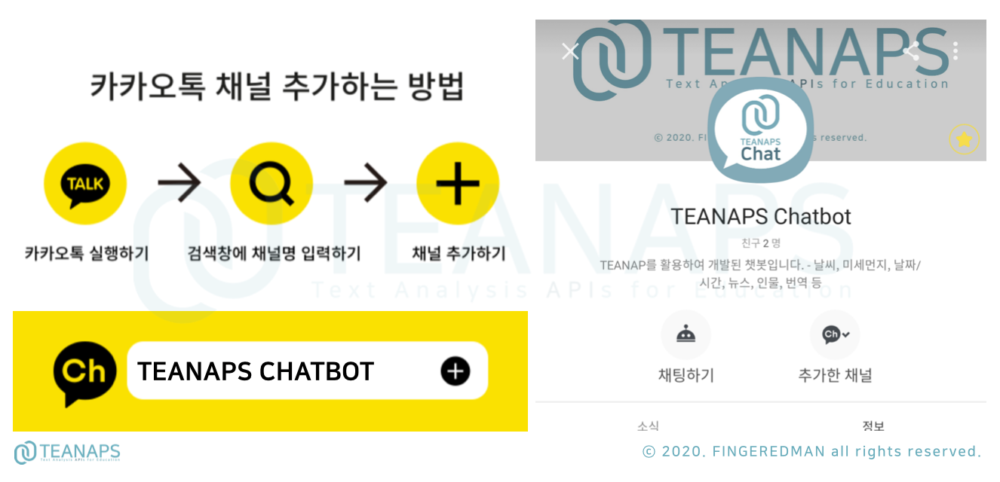
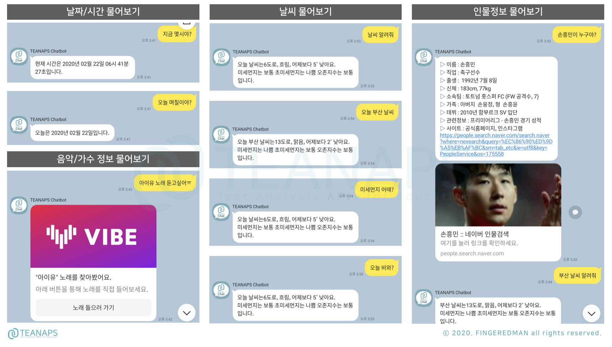
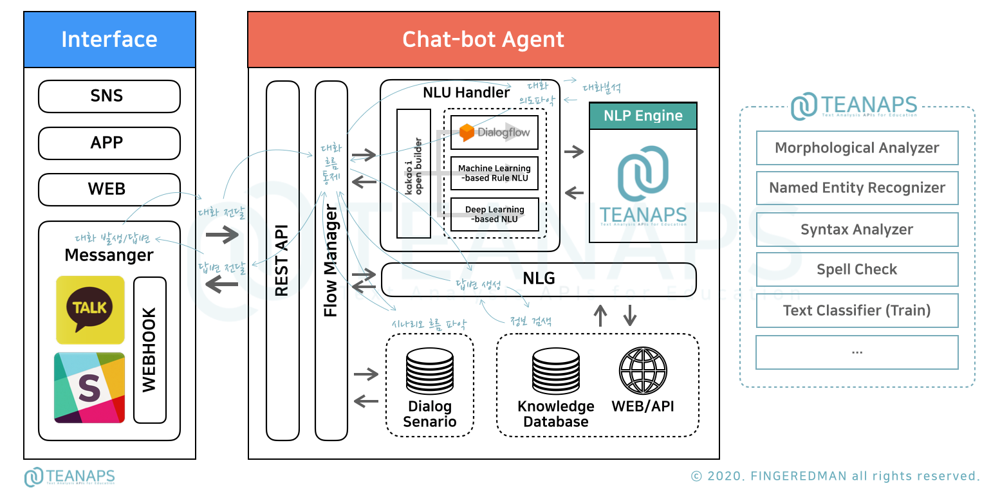

# `TEANAPS`를 활용해 하루만에 챗봇 구현하기

> `TEANAPS`를 활용해 보다 쉽게 챗봇을 구축하는 방법에 대해 알아봅니다.

- 본 자료는 텍스트 마이닝을 활용한 연구 및 강의를 위한 목적으로 제작되었습니다.
- 본 자료를 강의 또는 연구 목적으로 활용하고자 하시는 경우 꼭 아래 메일주소로 연락주세요.
- 본 자료에 대한 <U>상업적 활용과 허가되지 않은 배포를 금지</U>합니다.
- 강의, 저작권, 출판, 특허, 공동저자에 관련해서는 문의 바랍니다.
- **Contact : FINGEREDMAN(fingeredman@gmail.com)**

---
## What can you do with the `TEANAPS Chat-bot`?

- `TEANAPS` 챗봇은 카카오톡 플러스친구에서 `teanaps chatbot`을 검색해 친구추가 후 직접 사용해보실 수 있습니다.

  >   

- `TEANAPS` 챗봇은 정보검색, Q/A, 알리미 등 다양한 서비스를 연동하여 활용할 수 있습니다.

  >   

  > 

---
## How do chat-bots work?

> 챗봇의 기본 구조와 동작원리에 대해 알아봅니다.  

### `TEANAPS Chat-bot` Architecture

- `TEANAPS Chat-bot` 시스템 구성도

  > 

  > Notes :  
  > - `TEANAPS Chat-bot`의 구조는 간단한 Q/A 또는 정보검색을 위해 설계되었습니다.
  > - 챗봇은 그 용도와 역할에 따라 매우 복잡한 구조로 만들어지기도 합니다.

- `TEANAPS Chat-bot`이 사용자 질문에 답변하는 과정 (Process Diagram)

  > 

- 처리과정 및 역할

    - ① 질문
      
      > | Process   | Role                |
      > |-----------|---------------------|
      > | ①-1    | 사용자가 챗봇 인터페이스(카카오톡 채널, WEB 채팅창, SNS 메신저, Slack 등)에 대화(질문)를 입력합니다. ("청파동 주변 맛집 찾아줘!") | 
      > |        | 사용자가 입력한 대화 문장을 [②-1]의 의도분류기로 전달합니다. |   
      > | ①-2    | 사용자가 [①-3]의 질문에 답변을 입력합니다. | 
      > |        | 사용자가 입력한 답변을 [②-3]으로 전달하고 답변에서 추출한 정보로 부족한 메타 정보를 보완합니다. |
      > | ①-3    | 사용자가 입력한 대화 문장에 대해 답변을 위한 정보가 부족한 경우, 추가적인 메타 정보를 사용자에게 질문합니다.|
      > |        | 예를들어, "맛집을 알려줘"라는 대화 문장을 입력한 경우, 어느 지역의 맛집정보를 찾아야할지에 대한 정보가 없기 때문에 "어느지역 맛집을 알려드릴까요?"와 같이 부족한 정보에 대해 사용자에게 입력을 요청합니다. | 

    - ② 답변파악

      > | Process   | Role                |
      > |-----------|---------------------|
      > | ②-1      | 의도분류기를 활용해 대화 문장이 사전에 정의된 의도 분류에 속할 확률을 계산합니다. (날씨 알려줘/20%, 뉴스 찾아줘/10%, 맛집 알려줘/70%) | 
      > |          | 대화 문장의 의도를 정확히 분류하기 위해, 1개 이상의 의도분류기를 활용하여 가장 높은 확률을 가진 의도 분류를 선정합니다.   
      > |          | 확률값의 임계치를 설정하고(60% 이상) 선정된 의도의 확률값이 임계치 이상인지 확인합니다. | 
      > |          | 확률값이 임계치 이상이면 [②-3] 과정으로 넘어가고, 이하이면 사용자에게 재질문[①-1']을 요청합니다. |
      > | ②-3      | 질문의 의도를 명확하게 파악하기 위해 질문에 포함된 메타 정보(시간정보, 인물명, 장소명 등)를 추출합니다. | 
      > | ②-4      | 질문에 포함된 메타 정보가 충분한지 확인합니다. (의도가 맛집 정보를 물어보는 경우, 장소명 포함여부 확인) | 
      > |          | 메타 정보가 충분하면 [③-3] 과정으로 넘어가고, 충분하지 않으면 [①-3] 과정으로 넘어가 필요한 메타 정보를 사용자에게 질문합니다. |

    - ③ 답변생성

      > | Process   | Role                |
      > |-----------|---------------------| 
      > | ③-1      | 사용자에게 전달할 답변형식을 선정하고 답변을 생성합니다. | 
      > |          | 의도 분류의 종류와 답변을 위한 정보의 유형에 따라서 서로 다른 답변 형식(텍스트, 리스트뷰, 캐로셀, 링크 등)을 사용합니다. | 
      > | ③-2      | [③-3]에서 찾은 정보가 답변하기에 충분한지 미리 확인합니다. | 
      > |          | 예를들어, "맛집을 알려줘"라는 대화 문장에 대해 답변할 수 있는 정보를 찾을 수 없는경우, [③-1] 과정에서 답변을 생성할 수 없습니다. |
      > |          | 정보가 충분한 경우 [③-1] 과정으로 넘어가고, 충분하지 않으면 사용자에게 재질문[①-1']을 요청합니다. |
      > | ③-3      | 답변을 위한 정보를 지식DB나 웹페이지에서 가져옵니다. |

    - ④ 답변

      > | Process   | Role                |
      > |-----------|---------------------|  
      > | ④-1      | 사용자에게 답변을 전달합니다. ("청파동 맛집 정보를 알려드릴게요~!" + 맛집 정보 리스트) |  
      > |          | 사용자가 대화 문장을 입력할 때부터 챗봇이 답변을 전달하는 과정까지 하나의 채팅 Flow (일종의 Session)가 유지되며, Flow 종료 후에는 새로운 Flow가 시작됩니다. |  

---
## Update History
> 2020.02.09. 기본 구성 입력   
> 2020.03.01. `Documentation` 업데이트   

  
---

ⓒ 2020. FINGEREDMAN all rights reserved.

